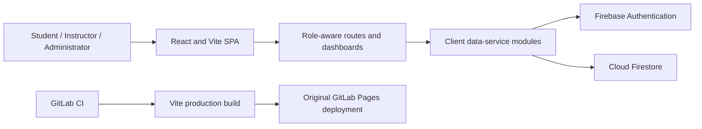

# LearnSphere

A role-based learning management system for organising courses, classrooms, lessons, enrolment, progress, and reporting.

> **Project status:** Completed university team MVP<br>
> **Current portfolio status:** Public portfolio repository<br>
> **Live demo:** Not currently maintained

## Overview

LearnSphere was developed as a five-person team project for a university software engineering process and management unit.

The platform brings student, instructor, and administrator workflows into one application:

- students can discover learning content, join courses and classrooms, track learning activities, and use a built-in focus mode;
- instructors can create and manage lessons, courses, classrooms, enrolment, and student progress; and
- administrators can manage users, registration tokens, and platform-level reporting.

The project was delivered across three Scrum sprints, combining product development with sprint planning, estimation, acceptance criteria, testing, reviews, and retrospectives.

## Core workflows

### Student

- Register and sign in through Firebase Authentication.
- Join available courses and classrooms.
- Browse lessons, assignments, and enrolled learning content.
- View course and classroom information and learning progress.
- Use a configurable focus timer with a temporary task list and visual progress feedback.

### Instructor

- Create, edit, view, archive, and manage lessons.
- Organise lessons into courses with prerequisites and credit information.
- Create and manage classrooms, enrolment, dates, assignments, and student lists.
- Review and update student learning progress.
- View reports scoped to the instructor's learning content.

### Administrator

- Generate and revoke registration tokens for students and instructors.
- Search and manage platform users.
- Access platform-wide course, classroom, lesson, and participation summaries.
- Review active, draft, and archived content.

## Architecture



The application is implemented as a React single-page application. Role-aware pages and dashboards call shared client-side service modules, which coordinate authentication and Firestore operations.

The root Vite configuration builds the application from `Learn_Sphere/src` and also includes several standalone development and data-management pages used during the original team project.

## Engineering decisions

### Role-aware product structure

Student, instructor, and administrator experiences share the same application shell while exposing different actions and information.

The UI adapts to the authenticated user's role—for example, students receive learning and focus tools, instructors receive content-management and scoped reporting tools, and administrators receive token and user-management controls.

These client-side checks support the interface but do not replace properly configured Firebase security rules.

### Learning-content hierarchy

The application models learning content through three related levels:

1. **Lessons** hold individual units of learning content.
2. **Courses** organise lessons, prerequisites, and credit information.
3. **Classrooms** connect courses, instructors, students, dates, assignments, and progress.

Keeping these concepts separate allowed the team to support content reuse while still managing individual teaching groups.

### Firebase integration

Firebase Authentication manages application accounts and sessions, while Cloud Firestore stores users, lessons, courses, classrooms, enrolment, tokens, and reporting data.

Firebase access is organised through reusable modules under `Learn_Sphere/src/components`, keeping data operations separate from most page and dashboard components.

### Static-site deployment

The team used Vite and GitLab CI to produce a static build for GitLab Pages. Deployment required repeated investigation of repository base paths, asset resolution, and client-side routing behaviour before the application could be tested online by the team.

The original configuration is tied to the former GitLab repository path and is not presented as an actively maintained public deployment.

## Scrum delivery

The project was developed across three Scrum sprints using:

- sprint planning and backlog refinement;
- story-point estimation;
- acceptance criteria and Definition of Done;
- work-in-progress and blocker tracking;
- sprint reviews and retrospectives; and
- role-based manual test cases.

Project-management links and internal meeting records are intentionally excluded from this portfolio README.

## Technology stack

| Area | Technologies |
| --- | --- |
| Frontend | React, JavaScript, CSS Modules |
| Build tooling | Vite, npm |
| Routing | React Router |
| Authentication | Firebase Authentication |
| Data | Cloud Firestore |
| Delivery | Git, GitLab CI, GitLab Pages |
| Team process | Scrum, Jira, story points, acceptance criteria, retrospectives |

## Project structure

```text
.
├── Learn_Sphere/
│   ├── images/                 # Application images and icons
│   └── src/
│       ├── components/         # Shared UI and Firebase data operations
│       ├── dashboards/         # Lesson, course, classroom, report, and admin views
│       ├── forms/              # Authentication and registration forms
│       ├── layout/             # Shared page headers and layout
│       ├── pages/              # Application-level routes
│       ├── App.jsx
│       └── main.jsx
├── docs/                       # Manual test-case artefacts
├── index.html                  # Main Vite entry point
├── vite.config.js              # Root build and deployment configuration
├── .gitlab-ci.yml              # Original GitLab Pages pipeline
├── package.json
└── README.md
```

## Running locally

### Requirements

- A current Node.js LTS release
- npm
- Access to an appropriately configured Firebase project

### Installation

From the repository root:

```bash
npm ci
npm run dev
```

Open the local URL shown by Vite.

### Production build

```bash
npm run build
npm run preview
```

The current portfolio branch has been successfully verified with:

```bash
npm run build
```

The build completes successfully, with warnings for several legacy unused Firebase imports.

## Firebase configuration

The original application was connected to the team's Firebase environment. A fresh independent deployment should:

1. create a separate Firebase project;
2. enable the required authentication provider;
3. provision the required Firestore collections;
4. replace the web application configuration in `Learn_Sphere/src/components/firebaseConfig.js`; and
5. define and validate role-appropriate Firebase security rules.

Firebase web configuration does not replace database access control. Do not deploy the application against a production Firebase project without reviewing its Authentication and Firestore rules.

## Testing and validation

The team created role-based and user-story-based manual test cases across the project sprints. Selected test-case artefacts remain under `docs/`.

The repository does not currently contain an automated test command or coverage baseline. Current portfolio validation is limited to source review and a successful production build.

## Team and personal contribution

LearnSphere was developed by a five-person team:

- Chin Min Hao
- Joanne Youssel Rahmanto
- Lai Cen Yee
- Ooi Jing Wee
- Ti Jia Don

The complete product is a shared team outcome.

I contributed as both **Scrum Master and Developer**.

### Scrum Master contribution

Across three sprints, I helped coordinate:

- sprint planning and story-point estimation;
- acceptance criteria and Definition of Done;
- work-in-progress and blocker tracking;
- sprint reviews and retrospectives; and
- communication between product, frontend, data, testing, and deployment work.

### Development contribution

My implementation and integration work included:

- registration, authentication, and reusable form components;
- lesson, course, and classroom interfaces and data workflows;
- classroom enrolment, student lists, assignments, and progress-related features;
- administrator token and user-management interfaces;
- reporting dashboards for lessons, courses, and classrooms;
- the student focus-mode timer and task experience;
- UI improvements and cross-feature bug fixes; and
- investigation of Vite base paths, routing, and GitLab Pages deployment.

These points describe my personal contributions without claiming sole ownership of the complete application or every feature.

## Current limitations

- The original Firebase and GitLab Pages environments are not maintained as a public demo.
- The repository does not currently include automated tests or a lint command.
- Routing and Vite base-path configuration are tied to the original GitLab repository name and require adjustment for another hosting location.
- Several legacy Firebase imports generate build warnings.
- Firebase security rules and a clean standalone data environment have not been provisioned and validated from scratch.
- Earlier Git history includes generated dependencies and configuration from the team's now-retired development environment; the current branch has been cleaned, while deeper history polish is deferred.
- This archived university team project is published with team approval and remains subject to the usage boundary below.

## License

No open-source license has been added. All rights are reserved by the project contributors unless a licence is provided later.
